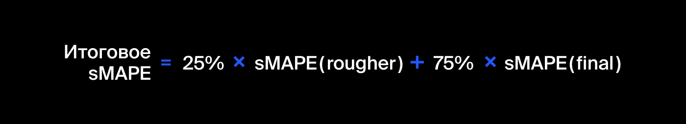

# Коэффициент восстановления золота
### Описание проекта
Данные находятся в трёх файлах: 
* gold_industry_train.csv — обучающая выборка;
* gold_industry_test.csv — тестовая выборка;
* gold_industry_full.csv — исходные данные.

Данные индексируются датой и временем получения информации (признак date). Соседние по времени параметры часто похожи. \
Некоторые параметры недоступны, потому что замеряются и/или рассчитываются значительно позже. Из-за этого в тестовой выборке отсутствуют некоторые признаки, которые могут быть в обучающей. Также в тестовом наборе нет целевых признаков. \
Исходный датасет содержит обучающую и тестовую выборки со всеми признаками. \
В вашем распоряжении сырые данные: их просто выгрузили из хранилища. Прежде чем приступить к построению модели, проверьте по нашей инструкции их на корректность. \
### Инструкция по выполнению проекта
1. Подготовьте данные
    1. Откройте файлы и изучите их. 
    2. Проверьте, что эффективность обогащения рассчитана правильно. Вычислите её на обучающей выборке для признака rougher.output.recovery. Найдите MAE между вашими расчётами и значением признака. Опишите выводы.
    3. Проанализируйте признаки, недоступные в тестовой выборке. Что это за параметры? К какому типу относятся?
    4. Проведите предобработку данных.
2. Проанализируйте данные
    1. Посмотрите, как меняется концентрация металлов (Au, Ag, Pb) на различных этапах: в сырье, в черновом концентрате, в концентрате после первой очистки и в финальном концентрате. Какие особенности имеют распределения? Опишите выводы.
    2.  Сравните распределения размеров гранул исходного сырья на обучающей и тестовой выборках. Если распределения сильно отличаются друг от друга, оценка модели будет неправильной.
    3. Исследуйте суммарную концентрацию металлов на разных стадиях: в сырье, в черновом концентрате, в концентрате после первой очистки и в финальном концентрате.
3. Постройте модель
    1. Напишите функцию для вычисления итоговой sMAPE.
    2. Обучите разные модели и оцените их качество кросс-валидацией. Выберите лучшую модель и проверьте её на тестовой выборке. Опишите выводы.
### Формулы метрик качества:
Формула sMAPE

Формула итогового sMAPE

